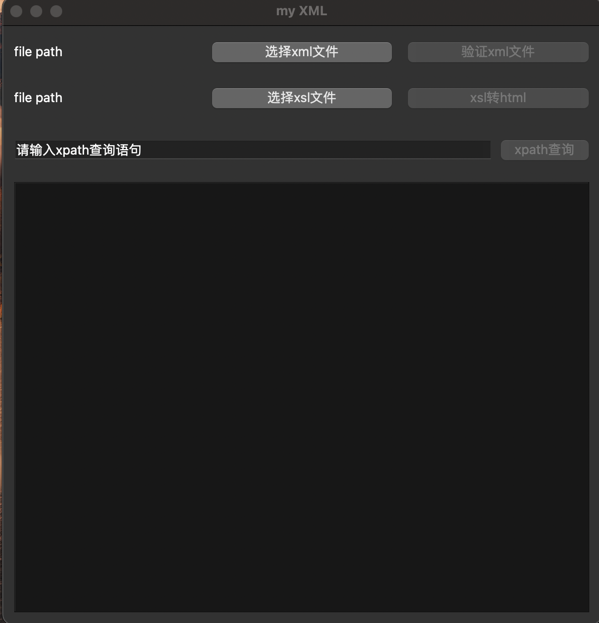
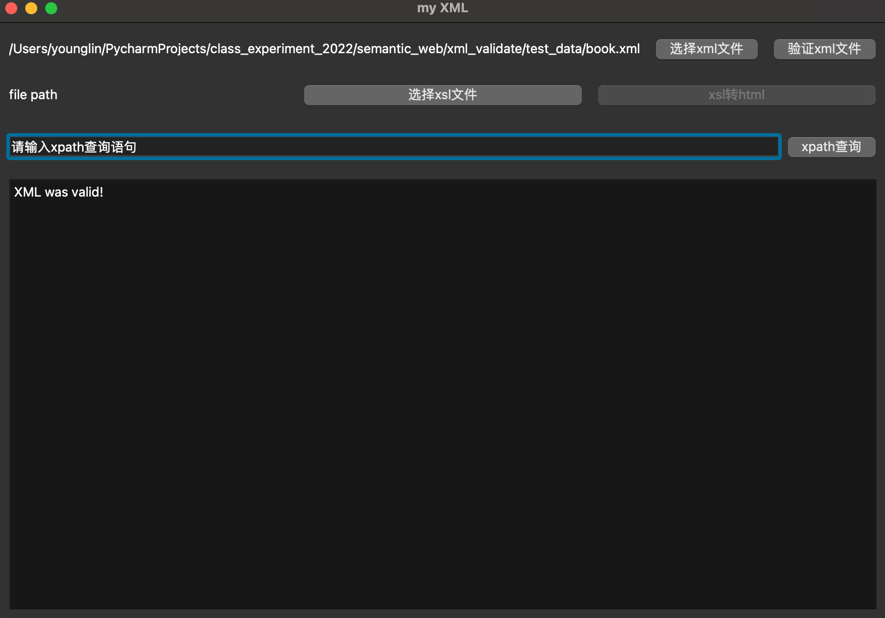
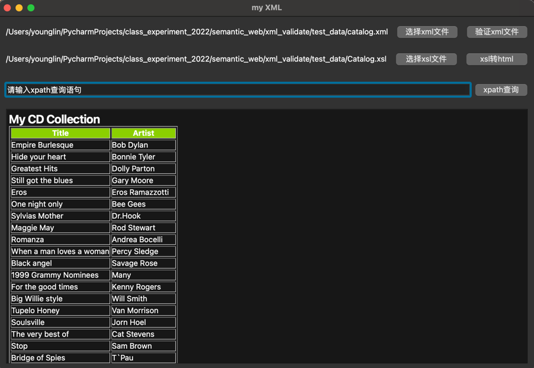
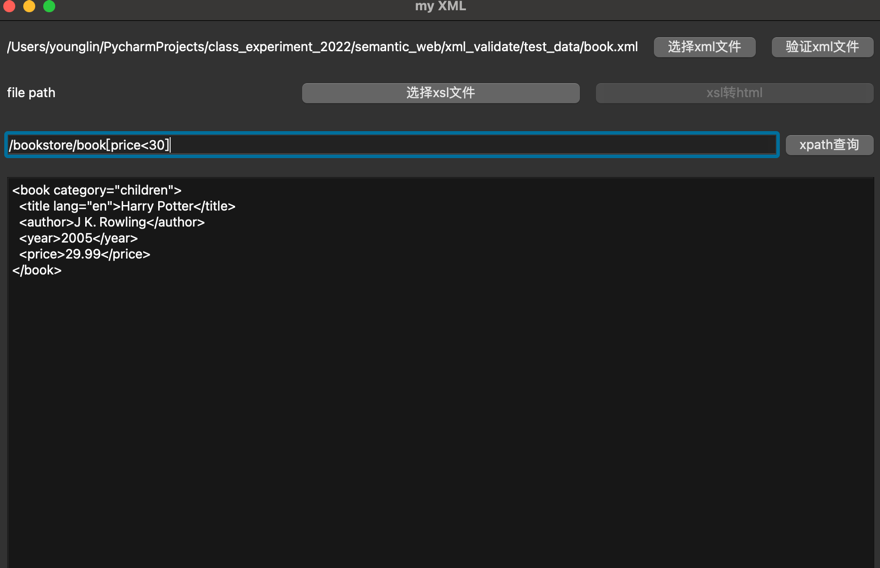

# XML Validate

### 实现的功能
1. 采用lxml库，针对DTD或者XML Schema规则验证的XML文档；
2. 可使用XPath语句查询XML文档中的内容；
3. 可根据XSL文档的模版将XML文件转成HTML文件；

### 可视化界面
采用PyQt6实现，由于初学PyQt，可视化方面存在诸多不足，日后有时间再加以改进吧。

### 运行方式
`python3 xml_validate.py`

### 运行展示
1. 初始截图：

2. 验证XML文件：

3. xsl转html：

4. xpath查询：
